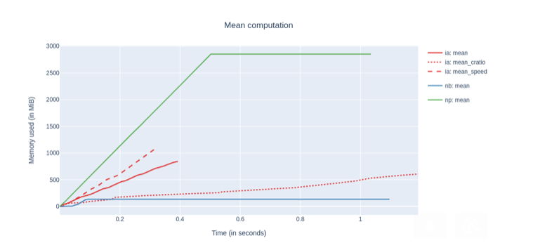

---
jupytext:
  formats: md:myst
  text_representation:
    extension: .md
    format_name: myst
    format_version: 0.13
    jupytext_version: 1.11.3
kernelspec:
  display_name: Python 3
  language: python
  name: python3
---

+++ {"slideshow": {"slide_type": "slide"}}

# Caterva: a multidimensional container with double partitioning

The Blosc Developer Team. SciPy Conference 2021.

+++ {"slideshow": {"slide_type": "slide"}}

## Who we are?


Caterva is an open source project that has been created by Aleix Alcacer, member of the Blosc Development Team. The leader and founder of this group is Francesc Alted,
an open source enthusiast responsible of projects like PyTables or Blosc.

+++ {"slideshow": {"slide_type": "slide"}}

## Poster Outline

1. Background
1. Why Caterva?
    1. Double partitioning
    1. No data type info
    1. Metalayers. ironArray
1. Future Work

+++ {"slideshow": {"slide_type": "slide"}}

## Background

To understand Caterva it is important to know some terms that are directly related to it.

- Data compression is the process of encoding, restructuring or otherwise modifying data in order to reduce its size. Caterva usually works with compressed datasets, making easier to the user to manipulate this processed data.

- Data chunking is a technique that consists of dividing a dataset into partitions of a specific size (chunks). Caterva algorithms implement a deeper level of this strategy to achieve better performance.

+++ {"slideshow": {"slide_type": "slide"}, "cell_style": "center"}

## Why Caterva?

Caterva is a C library for handling multi-dimensional, chunked, compressed datasets in an easy and fast way. Moreover, there exists not only a Caterva GitHub repository in C, but also a Caterva API in Python.

Todo:

- Insert Caterva image

+++ {"slideshow": {"slide_type": "subslide"}}

### Use cases

Caterva can be used for a great variety of datasets. However, when it really stands out is with multidimensional ones because not every library is prepared to handle these datasets once they are compressed. Specifically, Caterva is really useful for extracting slices of compressed data because, thanks to the chunking machinery it implements, Caterva minimizes the amount of data it has to decompress to obtain the slice, and therefore the time it costs.

Accordingly, for cases where the slicing performance is crucial Caterva turns out to be a good alternative to Zarr and HDF5.

+++ {"slideshow": {"slide_type": "slide"}}

## Main features

1. **Double partitioning. Getting and setting data**
1. No data type info
1. Metalayers. ironArray

+++ {"slideshow": {"slide_type": "slide"}}

## Double partitioning


Caterva stores data into multidimensional chunks, which makes slices extraction from compressed data more efficient since only the chunks containing the slices are decompressed instead of the entire superchunk. Caterva also introduces a new level of chunking. Within each chunk, the data is re-chunked into smaller multidimensional sets called blocks. 
In this way, Caterva can read blocks individually (and also in parallel) instead of chunks, which improves slices extraction by decompressing only the blocks 
containing the slice instead of the whole chunks.

+++ {"slideshow": {"slide_type": "slide"}}

### Getting data

```{code-cell} ipython3
import zarr
import caterva as cat
import numpy as np
import h5py as h5
import hdf5plugin as h5plugin
%load_ext memprofiler
```

+++ {"slideshow": {"slide_type": "-"}}

First of all, we define the shape and the chunks and blocks for the arrays. As we can see, the second dimension is optimized to extract hyperslices.

```{code-cell} ipython3
shape = (8_000, 8_000)
chunks = (4_000, 100)
blocks = (500, 25)
dtype = np.dtype("f8")
itemsize = dtype.itemsize
```

+++ {"slideshow": {"slide_type": "subslide"}}

Now, we create a Caterva array and a Zarr array from a Numpy array using the shapes defined before.

```{code-cell} ipython3
data = np.arange(np.prod(shape), dtype=dtype).reshape(shape)
```

```{code-cell} ipython3
---
slideshow:
  slide_type: '-'
---
c_data = cat.asarray(data, chunks=chunks, blocks=blocks)
```

```{code-cell} ipython3
---
slideshow:
  slide_type: '-'
---
z_data = zarr.array(data, chunks=chunks)
```

```{code-cell} ipython3
f = h5.File('hdf5_file.h5', 'w', driver="core")
f.create_dataset("data", shape, chunks=chunks, data=data, **h5plugin.Blosc())
h_data = f["data"]
```

```{code-cell} ipython3
---
cell_style: center
slideshow:
  slide_type: '-'
---
c_data.info
```

```{code-cell} ipython3
:cell_style: center

z_data.info
```

+++ {"slideshow": {"slide_type": "subslide"}}

Compression ratios are different due to data organitzation. Explain it!

```{code-cell} ipython3
---
slideshow:
  slide_type: subslide
---
planes_id0 = np.random.randint(0, shape[0], 100)
```

```{code-cell} ipython3
%%mprof_run -q caterva::id0

for i in planes_id0:
    block = c_data[i, :]
```

```{code-cell} ipython3
---
slideshow:
  slide_type: '-'
---
%%mprof_run -q zarr::id0

for i in planes_id0:
    block = z_data[i, :]
```

```{code-cell} ipython3
---
slideshow:
  slide_type: '-'
---
%%mprof_run -q hdf5::id0

for i in planes_id0:
    block = h_data[i, :]
```

```{code-cell} ipython3
---
slideshow:
  slide_type: subslide
---
planes_id1 = np.random.randint(0, shape[1], 100)
```

```{code-cell} ipython3
%%mprof_run -q caterva::id1

for i in planes_id1:
    block = c_data[:, i]
```

```{code-cell} ipython3
---
slideshow:
  slide_type: '-'
---
%%mprof_run -q zarr::id1

for i in planes_id1:
    block = z_data[:, i]
```

```{code-cell} ipython3
---
slideshow:
  slide_type: '-'
---
%%mprof_run -q hdf5::id1

for i in planes_id1:
    block = h_data[:, i]
```

```{code-cell} ipython3
---
slideshow:
  slide_type: subslide
---
%mprof_barplot --title "Getting data" --variable time --groupby 1 .*
```

```{code-cell} ipython3
f.close()
```

+++ {"slideshow": {"slide_type": "slide"}}

### Setting data

```{code-cell} ipython3
---
slideshow:
  slide_type: '-'
---
c_data = cat.empty(shape, itemsize, chunks=chunks, blocks=blocks)

z_data = zarr.empty(shape, dtype=dtype, chunks=chunks)

f = h5.File('hdf5_file.h5', 'w', driver="core")
f.create_dataset("data", shape, chunks=chunks, **h5plugin.Blosc())
h_data = f["data"]
```

```{code-cell} ipython3
---
slideshow:
  slide_type: subslide
---
planes_id0 = np.random.randint(0, shape[0], 100)
block_id0 = np.arange(shape[0], dtype=dtype)
```

```{code-cell} ipython3
%%mprof_run -q caterva::id0

for i in planes_id0:
    c_data[i, :] = block_id0
```

```{code-cell} ipython3
---
slideshow:
  slide_type: '-'
---
%%mprof_run -q zarr::id0

for i in planes_id0:
    z_data[i, :] = block_id0
```

```{code-cell} ipython3
---
slideshow:
  slide_type: '-'
---
%%mprof_run -q hdf5::id0

for i in planes_id0:
    h_data[i, :] = block_id0
```

```{code-cell} ipython3
---
slideshow:
  slide_type: subslide
---
planes_id1 = np.random.randint(0, shape[1], 100)
block_id1 = np.arange(shape[1], dtype=dtype)
```

```{code-cell} ipython3
%%mprof_run -q caterva::id1

for i in planes_id1:
    c_data[:, i] = block_id1
```

```{code-cell} ipython3
---
slideshow:
  slide_type: '-'
---
%%mprof_run -q zarr::id1

for i in planes_id1:
    z_data[:, i] = block_id1
```

```{code-cell} ipython3
---
slideshow:
  slide_type: '-'
---
%%mprof_run -q hdf5::id1

for i in planes_id1:
    h_data[:, i] = block_id1
```

```{code-cell} ipython3
---
slideshow:
  slide_type: subslide
---
%mprof_barplot --title "Setting data" --variable time --groupby 1 .*
```

```{code-cell} ipython3
f.close()
```

+++ {"slideshow": {"slide_type": "slide"}}

## Main features

1. Double partitioning. Getting and setting data
1. **No data type info**
1. Metalayers. ironArray

+++ {"slideshow": {"slide_type": "slide"}}

## No data type info

Caterva only stores variables itemsize instead of the type. This makes the library more lightweight and gives it a more general utility allowing users to define their own custom data types via metalayers.

+++ {"slideshow": {"slide_type": "subslide"}}

Show the integration with other libraries as numpy

```{code-cell} ipython3
---
slideshow:
  slide_type: '-'
---
import caterva as cat
import numpy as np

shape = (1_000, 1_000)
chunks = (500, 20)
blocks = (200, 10)
dtype = np.dtype("f4")
itemsize = dtype.itemsize

a = cat.empty(shape, itemsize, chunks=chunks, blocks=blocks)

for i in range(shape[0]):
    a[i] = np.linspace(0, 1, shape[1], dtype=dtype)
```

```{code-cell} ipython3
---
slideshow:
  slide_type: subslide
---
b = a[5:7, 5:10]

b.info
```

Talk about plainbuffer backend and the support of buffer and array protocols.

```{code-cell} ipython3
---
slideshow:
  slide_type: subslide
---
c = np.asarray(b)

c
```

Explain that a cast is needed

```{code-cell} ipython3
---
slideshow:
  slide_type: subslide
---
c = np.asarray(b).view(dtype)

c
```

```{code-cell} ipython3
b[0] = np.arange(5, dtype=dtype)

c
```

Explain the behaviour. Share the same buffer. No copies are made.

+++ {"slideshow": {"slide_type": "slide"}}

## Main features

1. Double partitioning. Getting and setting data
1. No data type info
1. **Metalayers. ironArray**

+++ {"slideshow": {"slide_type": "slide"}}

## Metalayers

Metalayers are small metadata for informing about the kind of data that is stored on a Caterva container.
Caterva specifies a metalayer on top of a Blosc2 container for storing multidimensional information. This metalayer can be modified so that the shapes can be updated.

You can use metalayers for adapting Caterva containers to your own needs.

+++ {"slideshow": {"slide_type": "subslide"}}

We create an array with one metalayer storing some info.

```{code-cell} ipython3
---
slideshow:
  slide_type: '-'
---
import caterva as cat
from struct import pack

urlpath = "arr_with_meta.caterva"

shape = (1_000, 1_000)
chunks = (500, 500)
blocks = (10, 250)

meta = {
    b"date": b"01/01/2021"
}

a = cat.full(shape, fill_value=pack("f", 3.14), chunks=chunks, blocks=blocks, meta=meta,
             urlpath=urlpath)
```

```{code-cell} ipython3
---
slideshow:
  slide_type: subslide
---
a = cat.open(urlpath)
```

Get the name of all metalayers on the array:

```{code-cell} ipython3
a.meta.keys()
```

Get the informatrion stored in the *date* metalayer:

```{code-cell} ipython3
assert a.meta.get("date") == a.meta["date"]

a.meta["date"]
```

Update the content of the *date* metalayer. Comment that the length of the metalayer can not change. Use vl-metalayers (in the roadmap).

```{code-cell} ipython3
a.meta["date"] = b"08/01/2021"
try:
    a.meta["date"] = b"8/1/2021"
except ValueError as err:
    print(err)
```

+++ {"slideshow": {"slide_type": "subslide"}}

Caterva introduces by iteself a metalayer storing the multidimensional information. Inspect Caterva metalayer.

```{code-cell} ipython3
---
slideshow:
  slide_type: '-'
---
import msgpack

caterva_meta = msgpack.unpackb(a.meta.get("caterva"))

print(f"Format version: {caterva_meta[0]}")
print(f"N. dimensions: {caterva_meta[1]}")
print(f"Shape: {caterva_meta[2]}")
print(f"Chunks: {caterva_meta[3]}")
print(f"Blocks: {caterva_meta[4]}")

cat.remove(urlpath)
```

+++ {"slideshow": {"slide_type": "slide"}}

### Iron Array

ironArray is an example of a library built on top of Caterva. It is a set of tools optimized for performing operations on floating-point data sets.

The highlights of ironArray are:

- High performance matrix and vector computations.
- Automatic data compression and decompression.
- Contiguous or sparse storage.
- Tunable performance optimizations that leverage your specific CPUs caches, memory and disks.

For more information about ironArray, see: https://ironarray.io

+++ {"slideshow": {"slide_type": "subslide"}}

#### Example

```{code-cell} ipython3
# import iarrayce as ia

# Example of use
```

+++ {"slideshow": {"slide_type": "subslide"}}

#### Computation performance

In this plot, we can see the performance of ironArray (*ia*) computing the mean of three datasets against numba (*nb*) and numpy (*np*):


We see that numba takes even more time than NumPy. This is probably because of the additional time required by the compilation step in numba. Memory wise the consumption is very low, but this is expected because we are reusing an existing NumPy array as the destination of the computation; in general, and for large datasets, the memory consumption of numba should be very close to NumPy.

+++ {"slideshow": {"slide_type": "slide"}}

## Future Work

- Resize array dimensions: this will allow to increase or decrease in size any dimension of the arrays.

- Improve slicing capabilities: currently Caterva only supports basic slicing based on start:stop ranges; we would like to extend this to start:stop:step as well as selections based on an array of booleans (similar to NumPy).

- Provide Python wheels: this will make the installation much more easier for the user.

- Variable length for metalayers: this would provide a lot of flexibility when defining types of variables.

+++ {"slideshow": {"slide_type": "slide"}}

## Acknowledgments

From the Caterva team we are glad to give a big thank to:

- SciPy for allowing us to participate in the congress.

- The NumFOCUS foundation for sponsoring Blosc.

- Huawei for making a donation via NumFOCUS to start developing Caterva.

- ironArray for making a donation to finish outlining Caterva.
