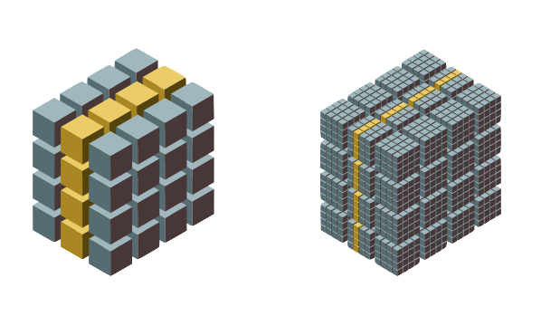

---
jupytext:
  formats: md:myst
  text_representation:
    extension: .md
    format_name: myst
    format_version: 0.13
    jupytext_version: 1.11.3
kernelspec:
  display_name: Python 3
  language: python
  name: python3
---

+++ {"slideshow": {"slide_type": "slide"}}

# Caterva: a multidimensional container with double partitioning

The Blosc Developers. SciPy Conference 2021.

+++ {"slideshow": {"slide_type": "slide"}}

## Who we are?


Caterva is an open source project that has been created by Aleix Alcacer, member of the Blosc Development Team. The leader and founder of this group is Francesc Alted,
an open source enthusiast responsible of projects like PyTables or Blosc.

+++ {"slideshow": {"slide_type": "slide"}}

## Poster Outline

1. Background
1. Why Caterva?
1. Main features
    1. Double partitioning
    1. No data type info
    1. Metalayers. ironArray
    1. Multiple formats
1. Future Work

+++ {"slideshow": {"slide_type": "slide"}}

## Background

To understand Caterva it is important to know some terms that are directly related to it.

Data compression is the process of encoding, restructuring or otherwise modifying data in order to reduce its size.

Otherwise, chunking is a technique that consists of dividing a dataset into partitions of a specific size (chunks).

Compression is really used for a great variety of data types and sizes, both in everyday leisure situations of a standard user such as compressing a photo or video, as well as for organizations that store large amounts of data. However, chunking is a more specific domain concept and is usually more related to Big Data and projects where decompression speed is important.

+++ {"slideshow": {"slide_type": "slide"}, "cell_style": "center"}

## What is Caterva?

Caterva is a C library for handling multi-dimensional, chunked, compressed datasets in an easy and fast way.

+++ {"slideshow": {"slide_type": "slide"}}

## Double partitioning



Caterva stores data into multidimensional chunks, which makes slices extraction more efficient since only the chunks containing the slices are decompressed instead 
of the entire superchunk. Caterva also introduces a new level of chunking. Within each chunk, the data is re-chunked into smaller multidimensional sets called blocks. 
In this way, Caterva can read blocks individually (and also in parallel) instead of chunks, which improves slices extraction by decompressing only the blocks 
containing the slice instead of the whole chunks.

```{code-cell} ipython3
import zarr
import caterva as cat
import numpy as np

%load_ext memprofiler
```

+++ {"slideshow": {"slide_type": "-"}}

First of all, we define the shape and the chunks and blocks for the arrays. As we can see, the second dimension is optimized to extract hyperslices.

```{code-cell} ipython3
shape = (8_000, 8_000)
chunks = (500, 50)
blocks = (500, 10)
dtype = np.dtype("f8")
itemsize = dtype.itemsize
```

+++ {"slideshow": {"slide_type": "subslide"}}

Now, we create a Caterva array and a Zarr array from a Numpy array using the shapes defined before.

```{code-cell} ipython3
data = np.arange(np.prod(shape), dtype=dtype).reshape(shape)
```

```{code-cell} ipython3
---
slideshow:
  slide_type: '-'
---
c_data = cat.asarray(data, chunks=chunks, blocks=blocks)
```

```{code-cell} ipython3
---
slideshow:
  slide_type: '-'
---
from numcodecs import Blosc

z_data = zarr.array(data, chunks=chunks)
```

```{code-cell} ipython3
---
cell_style: split
slideshow:
  slide_type: '-'
---
c_data.info
```

```{code-cell} ipython3
:cell_style: split

z_data.info
```

+++ {"slideshow": {"slide_type": "subslide"}}

Compression ratios are different due to data organitzation. Explain it!

```{code-cell} ipython3
---
slideshow:
  slide_type: subslide
---
planes_id0 = np.random.randint(0, shape[0], 100)
```

```{code-cell} ipython3
%%mprof_run -q caterva::id0

for i in planes_id0:
    block = c_data[i, :]
```

```{code-cell} ipython3
---
slideshow:
  slide_type: '-'
---
%%mprof_run -q zarr::id0

for i in planes_id0:
    block = z_data[i, :]
```

```{code-cell} ipython3
---
slideshow:
  slide_type: subslide
---
planes_id1 = np.random.randint(0, shape[1], 100)
```

```{code-cell} ipython3
%%mprof_run -q caterva::id1

for i in planes_id1:
    block = c_data[:, i]
```

```{code-cell} ipython3
---
slideshow:
  slide_type: '-'
---
%%mprof_run -q zarr::id1

for i in planes_id1:
    block = z_data[:, i]
```

```{code-cell} ipython3
---
slideshow:
  slide_type: subslide
---
%mprof_barplot --title "Getting items" --variable time --groupby 1 .*
```

+++ {"slideshow": {"slide_type": "slide"}}

## Setting items

```{code-cell} ipython3
---
slideshow:
  slide_type: '-'
---
c_data = cat.empty(shape, itemsize, chunks=chunks, blocks=blocks)

z_data = zarr.empty(shape, dtype=dtype, chunks=chunks)
```

```{code-cell} ipython3
---
slideshow:
  slide_type: subslide
---
planes_id0 = np.random.randint(0, shape[0], 100)
block_id0 = np.arange(shape[0], dtype=dtype)
```

```{code-cell} ipython3
%%mprof_run -q caterva::id0

for i in planes_id0:
    c_data[i, :] = block_id0
```

```{code-cell} ipython3
---
slideshow:
  slide_type: '-'
---
%%mprof_run -q zarr::id0

for i in planes_id0:
    z_data[i, :] = block_id0
```

```{code-cell} ipython3
---
slideshow:
  slide_type: subslide
---
planes_id1 = np.random.randint(0, shape[1], 100)
block_id1 = np.arange(shape[1], dtype=dtype)
```

```{code-cell} ipython3
%%mprof_run -q caterva::id1

for i in planes_id1:
    c_data[:, i] = block_id1
```

```{code-cell} ipython3
---
slideshow:
  slide_type: '-'
---
%%mprof_run -q zarr::id1

for i in planes_id1:
    z_data[:, i] = block_id1
```

```{code-cell} ipython3
---
slideshow:
  slide_type: subslide
---
%mprof_barplot --variable time --groupby 1 .*
```

+++ {"slideshow": {"slide_type": "slide"}}

## No data type information

Caterva only stores variables itemsize instead of the type. This makes the library more lightweight and gives it a more general utility allowing users to define their own custom data types via metalayers.

+++ {"slideshow": {"slide_type": "subslide"}}

Show the integration with other libraries as numpy

```{code-cell} ipython3
---
slideshow:
  slide_type: '-'
---
import caterva as cat
import numpy as np

shape = (1_000, 1_000)
chunks = (500, 20)
blocks = (200, 10)
dtype = np.dtype("f4")
itemsize = dtype.itemsize

a = cat.empty(shape, itemsize, chunks=chunks, blocks=blocks)

for i in range(shape[0]):
    a[i] = np.linspace(0, 1, shape[1], dtype=dtype)
```

```{code-cell} ipython3
---
slideshow:
  slide_type: subslide
---
b = a[5:7, 5:10]

b.info
```

Talk about plainbuffer backend and the support of buffer and array protocols.

```{code-cell} ipython3
---
slideshow:
  slide_type: subslide
---
c = np.asarray(b)

c
```

Explain that a cast is needed

```{code-cell} ipython3
c = np.asarray(b).view(dtype)

c
```

```{code-cell} ipython3
b[0] = np.arange(5, dtype=dtype)

c
```

Explain the behaviour. Share the same buffer. No copies are made.

+++ {"slideshow": {"slide_type": "slide"}}

## Metalayers

Metalayers are small metadata for informing about the kind of data that is stored on a Caterva container.
Caterva specifies a metalayer on top of a Blosc2 container for storing multidimensional information. This metalayer can be modified so that the shapes can be updated.

You can use metalayers for adapting Caterva containers to your own needs.

+++ {"slideshow": {"slide_type": "subslide"}}

We create an array with one metalayer storing some info.

```{code-cell} ipython3
---
slideshow:
  slide_type: '-'
---
import caterva as cat
from struct import pack

urlpath = "arr_with_meta.caterva"

shape = (1_000, 1_000)
chunks = (500, 500)
blocks = (10, 250)

meta = {
    b"date": b"01/01/2021"
}

a = cat.full(shape, fill_value=pack("f", 3.14), chunks=chunks, blocks=blocks, meta=meta,
             urlpath=urlpath)
```

```{code-cell} ipython3
---
slideshow:
  slide_type: subslide
---
a = cat.open(urlpath)
```

Get the name of all metalayers on the array:

```{code-cell} ipython3
a.meta.keys()
```

Get the informatrion stored in the *date* metalayer:

```{code-cell} ipython3
assert a.meta.get("date") == a.meta["date"]

a.meta["date"]
```

Update the content of the *date* metalayer. Comment that the length of the metalayer can not change. Use vl-metalayers (in the roadmap).

```{code-cell} ipython3
a.meta["date"] = b"08/01/2021"
try:
    a.meta["date"] = b"8/1/2021"
except ValueError as err:
    print(err)
```

+++ {"slideshow": {"slide_type": "subslide"}}

Caterva introduces by iteself a metalayer storing the multidimensional information. Inspect Caterva metalayer.

```{code-cell} ipython3
---
slideshow:
  slide_type: '-'
---
import msgpack

caterva_meta = msgpack.unpackb(a.meta.get("caterva"))

print(f"Format version: {caterva_meta[0]}")
print(f"N. dimensions: {caterva_meta[1]}")
print(f"Shape: {caterva_meta[2]}")
print(f"Chunks: {caterva_meta[3]}")
print(f"Blocks: {caterva_meta[4]}")

cat.remove(urlpath)
```

+++ {"slideshow": {"slide_type": "subslide"}}

### Iron Array

ironArray is a lightweight, flexible and fast toolkit for managing your data. It organizes your data into chunks that fit into the cache of your CPU, then uses 
standard map, reduce, filter, and collect algorithms to perform calculations on large arrays directly in the high-speed CPU cache.
Based on your preferences, it will tune your configuration to leverage your specific CPUs caches, memory and disks.

Introduce a metalayer on TOP of caterva storing the dtype.

```{code-cell} ipython3
# import iarrayce as ia

# Example of use
```
