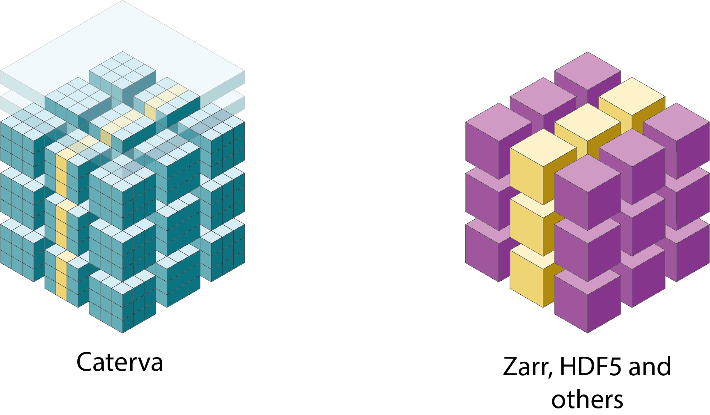

---
jupytext:
  formats: md:myst
  text_representation:
    extension: .md
    format_name: myst
    format_version: 0.13
    jupytext_version: 1.11.3
kernelspec:
  display_name: Python 3 (ipykernel)
  language: python
  name: python3
---

+++ {"slideshow": {"slide_type": "slide"}}

# Caterva: A Compressed And Multidimensional Container For Medium/Big Data

Francesc Alted, Aleix Alcacer and Christian Steiner. SciPy Conference 2021.


<table style="width:100%">
<tr>
    <td align="right">  </td>
    <td align="left">  </td>
</tr>
    </table>

+++ {"slideshow": {"slide_type": "slide"}}

## What Is Caterva?

Caterva is an open source C and Python library and a format that implements a compressed and multidimensional container.

It is different from existing solutions like HDF5 or Zarr in:

* **Higher performance**: support for double partitioning.
* **Improved compression** capabilities based on the new Blosc2 meta-compressor:
  * 64-bit containers
  * Data can be in-memory or on disk (persistent).
  * Filter pipeline. Use different filters simultaneously.
  * Plugin capabilities for filters and codecs: tailor it to your needs.
  * SIMD support for Intel, ARM and PowerPC.

https://github.com/Blosc/caterva/
https://github.com/Blosc/python-caterva/

+++ {"slideshow": {"slide_type": "slide"}}

## Poster Outline

1. **Background**
1. Why Caterva?
    1. Double partitioning. Getting and setting data.
    1. No data types. Buffer and array protocols.
    1. Metalayers.
1. ironArray and ironArray Community
1. Future Work

+++ {"slideshow": {"slide_type": "slide"}}

## Background

To understand Caterva it is important to know some terms that are directly related to it:

- Data compression is the process of encoding data in order to reduce its size. Caterva usually works with compressed datasets, making easier to the user to manipulate this processed data.

- Data chunking is a technique that consists of dividing a dataset into partitions of a specific size (chunks). Caterva algorithms implement a second level of this strategy to achieve better performance.

+++ {"slideshow": {"slide_type": "slide"}}

## Poster Outline

1. Background
1. **Why Caterva?**
    1. Double partitioning. Getting and setting data.
    1. No data types. Buffer and array protocols.
    1. Metalayers.
1. ironArray and ironArray Community
1. Future Work

+++ {"slideshow": {"slide_type": "slide"}, "cell_style": "center"}

## Why Caterva?

<div style="text-align: center;">
    
</div>

Caterva is a C library for handling multi-dimensional, chunked, compressed datasets in an easy and fast way. 

* Performant: leverage double partitioning for fast slicing.
* Metalayers: add metadata to your arrays.
* Type-less: flexibly define your own data types as metalayers.
* Open source: https://github.com/Blosc/python-caterva.

+++ {"slideshow": {"slide_type": "slide"}}

### Use cases

Caterva can be used for a great variety of scenarios. However, where it really stands out is with multidimensional ones. Specifically, Caterva is really useful for extracting slices of compressed data because, thanks to the chunking machinery it implements, it minimizes the amount of data that has to decompress so as to get the slice, and therefore the time it takes.

Accordingly, for cases where the slicing performance is important, Caterva turns out to be a good alternative to other solutions like Zarr or HDF5.

+++ {"slideshow": {"slide_type": "slide"}}

## Poster Outline

1. Background
1. Why Caterva?
    1. **Double partitioning. Getting and setting data.**
    1. No data types. Buffer and array protocols.
    1. Metalayers.
1. ironArray and ironArray Community
1. Future Work

+++ {"slideshow": {"slide_type": "slide"}}

## Double partitioning


<div style="text-align: center;">
    
</div>
Other chunking libraries store data into multidimensional chunks, which makes slices extraction from compressed data more efficient since only the chunks containing the slices are decompressed instead of the entire array. 

In addition, Caterva also introduces a new level of partitioning. Within each chunk, the data is repartitioned into smaller multidimensional sets called blocks.

In this way, Caterva can read blocks individually (and also in parallel) instead of whole chunks, which improves slices extraction by decompressing only those blocks containing the slice.

+++ {"slideshow": {"slide_type": "slide"}}

### Getting data

In this section, we are going to extract some hyperplanes from chunked arrays created with Caterva, Zarr, and HDF5. We will also analyze the performance differences between these libraries and how double partitioning affects Caterva.

In these three libraries, the data is stored using chunks of Blosc (that internally are split in blocks). However, while Zarr and HDF5 only introduce multidimensionality for chunks, Caterva introduces it for both chunks and blocks.

```{code-cell} ipython3
import zarr
import caterva as cat
import numpy as np
import h5py as h5
import hdf5plugin as h5plugin
%load_ext memprofiler
```

+++ {"slideshow": {"slide_type": "-"}}

First, shape, chunks and blocks parameters are defined. As we can see, the second dimension is optimized to extract hyperslices.

```{code-cell} ipython3
shape = (8_000, 8_000)
chunks = (4_000, 100)
blocks = (500, 25)
dtype = np.dtype("f8")
itemsize = dtype.itemsize
```

+++ {"slideshow": {"slide_type": "subslide"}}

Then, a Caterva array, a Zarr array, and a HDF5 array are created from a NumPy array using the parameters defined before.

```{code-cell} ipython3
data = np.arange(np.prod(shape), dtype=dtype).reshape(shape)
```

```{code-cell} ipython3
---
slideshow:
  slide_type: '-'
---
c_data = cat.asarray(data, chunks=chunks, blocks=blocks)
```

```{code-cell} ipython3
---
slideshow:
  slide_type: '-'
---
z_data = zarr.array(data, chunks=chunks)
```

```{code-cell} ipython3
f = h5.File('hdf5_file.h5', 'w', driver="core")
f.create_dataset("data", shape, chunks=chunks, data=data, **h5plugin.Blosc())
h_data = f["data"]
```

+++ {"slideshow": {"slide_type": "subslide"}}

Finally, some hyperplanes from the chunked arrays are extracted, and the performance is measured using the [*memprofiler*](https://github.com/aleixalcacer/memprofiler) plugin for jupyter.

```{code-cell} ipython3
---
slideshow:
  slide_type: '-'
---
planes_dim0 = np.random.randint(0, shape[0], 100)
```

```{code-cell} ipython3
%%mprof_run -q caterva::dim0

for i in planes_dim0:
    block = c_data[i, :]
```

```{code-cell} ipython3
---
slideshow:
  slide_type: '-'
---
%%mprof_run -q zarr::dim0

for i in planes_dim0:
    block = z_data[i, :]
```

```{code-cell} ipython3
---
slideshow:
  slide_type: '-'
---
%%mprof_run -q hdf5::dim0

for i in planes_dim0:
    block = h_data[i, :]
```

```{code-cell} ipython3
---
slideshow:
  slide_type: subslide
---
planes_dim1 = np.random.randint(0, shape[1], 100)
```

```{code-cell} ipython3
%%mprof_run -q caterva::dim1

for i in planes_dim1:
    block = c_data[:, i]
```

```{code-cell} ipython3
---
slideshow:
  slide_type: '-'
---
%%mprof_run -q zarr::dim1

for i in planes_dim1:
    block = z_data[:, i]
```

```{code-cell} ipython3
---
slideshow:
  slide_type: '-'
---
%%mprof_run -q hdf5::dim1

for i in planes_dim1:
    block = h_data[:, i]
```

```{code-cell} ipython3
f.close()
```

```{code-cell} ipython3
---
slideshow:
  slide_type: subslide
---
%mprof_barplot --title "Getting data (lower is better)" --variable time --groupby 1 .*
```

+++ {"slideshow": {"slide_type": "subslide"}}

As we can see in the graph, the slicing times are similar in the optimized dimension. However, Caterva performs better (by far) in the non-optimized dimension. This is because with double partitioning you only have to decompress the blocks containing the slice instead of the hole chunk.

This is why Caterva can be a good alternative to these widely-used libraries.

+++ {"slideshow": {"slide_type": "slide"}}

### Setting data


Now, we are going to update some hyperplanes from chunked arrays created with Caterva, Zarr, and HDF5. As before, we will also analyze the performance differences between these libraries and how double partitioning affects Caterva.

+++

First, some necessary parameters are defined.

```{code-cell} ipython3
shape = (8_000, 8_000)
chunks = (4_000, 100)
blocks = (500, 25)
dtype = np.dtype("f8")
itemsize = dtype.itemsize
```

Then, an empty array for each library is created with the previous parameters.

```{code-cell} ipython3
---
slideshow:
  slide_type: '-'
---
c_data = cat.empty(shape, itemsize, chunks=chunks, blocks=blocks)

z_data = zarr.empty(shape, dtype=dtype, chunks=chunks)

f = h5.File('hdf5_file.h5', 'w', driver="core")
f.create_dataset("data", shape, chunks=chunks, **h5plugin.Blosc())
h_data = f["data"]
```

+++ {"slideshow": {"slide_type": "subslide"}}

Finally, some hyperplanes from the chunked arrays are updated and the performance is measured as in the previous section.

```{code-cell} ipython3
---
slideshow:
  slide_type: '-'
---
planes_dim0 = np.random.randint(0, shape[0], 100)
block_dim0 = np.arange(shape[0], dtype=dtype)
```

```{code-cell} ipython3
%%mprof_run -q caterva::dim0

for i in planes_dim0:
    c_data[i, :] = block_dim0
```

```{code-cell} ipython3
---
slideshow:
  slide_type: '-'
---
%%mprof_run -q zarr::dim0

for i in planes_dim0:
    z_data[i, :] = block_dim0
```

```{code-cell} ipython3
---
slideshow:
  slide_type: '-'
---
%%mprof_run -q hdf5::dim0

for i in planes_dim0:
    h_data[i, :] = block_dim0
```

```{code-cell} ipython3
---
slideshow:
  slide_type: subslide
---
planes_dim1 = np.random.randint(0, shape[1], 100)
block_dim1 = np.arange(shape[1], dtype=dtype)
```

```{code-cell} ipython3
%%mprof_run -q caterva::dim1

for i in planes_dim1:
    c_data[:, i] = block_dim1
```

```{code-cell} ipython3
---
slideshow:
  slide_type: '-'
---
%%mprof_run -q zarr::dim1

for i in planes_dim1:
    z_data[:, i] = block_dim1
```

```{code-cell} ipython3
---
slideshow:
  slide_type: '-'
---
%%mprof_run -q hdf5::dim1

for i in planes_dim1:
    h_data[:, i] = block_dim1
```

```{code-cell} ipython3
---
slideshow:
  slide_type: '-'
---
f.close()
```

```{code-cell} ipython3
---
slideshow:
  slide_type: subslide
---
%mprof_barplot --title "Setting data (lower is better)" --variable time --groupby 1 .*
```

+++ {"slideshow": {"slide_type": "subslide"}}

In this case, the performance is also similar in the optimized dimension. However, there are differences in the non-optimized dimension. This because while Zarr and HDF5 only have to *reorganize* the data in chunks, Caterva has more work to do. As we explained, it 
also has to perform a second *reorganization* of the data because of the additional repartition for blocks.

+++ {"slideshow": {"slide_type": "slide"}}

## Poster Outline

1. Background
1. Why Caterva?
    1. Double partitioning. Getting and setting data.
    1. **No data types. Buffer and array protocols.**
    1. Metalayers.
1. ironArray and ironArray Community
1. Future Work

+++ {"slideshow": {"slide_type": "slide"}}

## No data types

Caterva only stores item size instead of the data type. The reasons for doing this are:

- It provides more flexibility, allowing users to define their own custom data types via metalayers.
- The Caterva library becomes *much* simpler, and hence more maintainable.
- New libraries can be built on top of Caterva that define their own data types (e.g. ironArray).

+++ {"slideshow": {"slide_type": "slide"}}

### Buffer and array protocol

Despite not providing a specific data type, Caterva supports both the buffer and array protocol. Let's see how it works.

```{code-cell} ipython3
---
slideshow:
  slide_type: '-'
---
import caterva as cat
import numpy as np

shape = (1_000, 1_000)
chunks = (500, 20)
blocks = (200, 10)
dtype = np.dtype("f8")
itemsize = dtype.itemsize

a = cat.empty(shape, itemsize, chunks=chunks, blocks=blocks)

for i in range(shape[0]):
    a[i] = np.linspace(0, 1, shape[1], dtype=dtype)
```

+++ {"slideshow": {"slide_type": "subslide"}}

When a slice is extracted from Caterva, the result is still another Caterva array. However, this new array is not based on Blosc but on a simple buffer.

```{code-cell} ipython3
---
slideshow:
  slide_type: '-'
---
b = a[5:7, 5:10]

b.info
```

+++ {"slideshow": {"slide_type": "-"}}

In this way, the protocols mentioned above can be used to work with slices of Caterva arrays from other libraries.

+++ {"slideshow": {"slide_type": "subslide"}}

But, what happen if we create a NumPy array from a Caterva array based on a simple buffer?

```{code-cell} ipython3
---
slideshow:
  slide_type: '-'
---
c = np.asarray(b)

c
```

So in this case the data type inferred is a byte string. Caterva assigns internally this data type because it is needed to implement the protocols.

In order to obtain the original array, a cast to the data has to be performed.

+++ {"slideshow": {"slide_type": "subslide"}}

To do this cast in NumPy, the `ndarray.view(dtype)` method can be used. In this case we want to view the NumPy array as an array of doubles.

```{code-cell} ipython3
---
slideshow:
  slide_type: '-'
---
c = np.asarray(b).view(dtype)

c
```

Finally, here is what happens when some elements of the Caterva array are updated.

```{code-cell} ipython3
b[0] = np.arange(5, dtype=dtype)

c
```

As can be seen, the updates also appear in the NumPy array. That is because the data buffer is shared between the 
Caterva array and the NumPy array. Therefore, having the buffer and array protocols allow Caterva to share data 
between different libraries without copies.

+++ {"slideshow": {"slide_type": "slide"}}

## Poster Outline

1. Background
1. Why Caterva?
    1. Double partitioning. Getting and setting data.
    1. No data types. Buffer and array protocols.
    1. **Metalayers.**
1. ironArray and ironArray Community
1. Future Work

+++ {"slideshow": {"slide_type": "slide"}}

## Metalayers

<div style="text-align: center;">
    
</div>

Metalayers are small metadata for informing about the kind of data that is stored on a Caterva container.
Caterva specifies a metalayer on top of a Blosc2 container for storing multidimensional information. This metalayer can be modified so that the shapes can be updated.

You can use metalayers for adapting Caterva containers to your own needs.

+++ {"slideshow": {"slide_type": "slide"}}

### Caterva metalayer

First, we define the shape and the chunks and blocks for the arrays. Then, we create an array with one metalayer storing a date.

```{code-cell} ipython3
---
slideshow:
  slide_type: '-'
---
import caterva as cat
from struct import pack

urlpath = "arr_with_meta.caterva"

shape = (1_000, 1_000)
chunks = (500, 500)
blocks = (10, 250)

meta = {
    b"date": b"01/01/2021"
}

a = cat.full(shape, fill_value=pack("f", 3.14), chunks=chunks, blocks=blocks, meta=meta,
             urlpath=urlpath)
```

```{code-cell} ipython3
---
slideshow:
  slide_type: subslide
---
a = cat.open(urlpath)
```

Then we get the name of all metalayers on the array:

```{code-cell} ipython3
a.meta.keys()
```

With that, we can get the information stored in e.g. the *date* metalayer:

```{code-cell} ipython3
assert a.meta.get("date") == a.meta["date"]

a.meta["date"]
```

Now, let's update the content of the *date* metalayer. It is important to remember that the length of a Caterva metalayer can **not** change, so you must be careful when updating.

```{code-cell} ipython3
a.meta["date"] = b"08/01/2021"
try:
    a.meta["date"] = b"8/1/2021"
except ValueError as err:
    print(err)
```

+++ {"slideshow": {"slide_type": "subslide"}}

Finally, you must know that Caterva introduces a metalayer in the array storing the multidimensional information. You can inspect such metalayer easily:

```{code-cell} ipython3
---
slideshow:
  slide_type: '-'
---
import msgpack

caterva_meta = msgpack.unpackb(a.meta.get("caterva"))

print(f"Format version: {caterva_meta[0]}")
print(f"N. dimensions: {caterva_meta[1]}")
print(f"Shape: {caterva_meta[2]}")
print(f"Chunks: {caterva_meta[3]}")
print(f"Blocks: {caterva_meta[4]}")

cat.remove(urlpath)
```

+++ {"slideshow": {"slide_type": "slide"}}

## Poster Outline

1. Background
1. Why Caterva?
    1. Double partitioning. Getting and setting data.
    1. No data types. Buffer and array protocols.
    1. Metalayers.
1. **ironArray and ironArray Community**
1. Future Work

+++ {"slideshow": {"slide_type": "slide"}}

### ironArray

<div style="text-align: center;">
    
</div>

ironArray is a library built on top of Caterva. It is a powerful, flexible and fast toolkit for managing and computing with floating-point datasets.

The highlights of ironArray are:

- High performance array and vector computations.
- Automatic data compression and decompression.
- Contiguous or sparse storage.
- Tunable performance optimizations that leverage your specific CPUs caches, memory and disks.

For more information about ironArray, see: https://ironarray.io

+++ {"slideshow": {"slide_type": "slide"}}

#### ironArray Community

<div style="text-align: center;">
    
</div>

ironArray Community is the open source counterpart of ironArray. It has been developed to mimic the same API than 
h5py or Zarr.  It implements the support for simple and double floating-point data using a metalayer.  With 
the community edition of ironArray you can extract slices from floating-point datasets in a simple way!

For more information about ironArray Community, see: https://ironarray.io/products

```{code-cell} ipython3
---
slideshow:
  slide_type: '-'
---
import iarray_community as ia
import numpy as np

shape = (1_000, 1_000)

chunks = (500, 500)
blocks = (100, 100)
dtype = np.float64
```

```{code-cell} ipython3
---
slideshow:
  slide_type: subslide
---
data = ia.zeros(shape, dtype=dtype, chunks=chunks, blocks=blocks, codec=ia.Codecs.LZ4)

data.info
```

```{code-cell} ipython3
---
slideshow:
  slide_type: subslide
---
data[0] = np.linspace(0, 1, shape[1], dtype=dtype)

s = data[0, 250:-740]

type(s)
```

```{code-cell} ipython3
s
```

+++ {"slideshow": {"slide_type": "slide"}}

#### Computation performance in ironArray

In order to better grasp what compression can bring to high performance computing, and in particular, how it can contribute to break the memory wall, let's see an example of computation with actual data (coming from a precipitation dataset).  Below we can see the performance of ironArray (*ia*) and NumPy (*np*) computing the mean of three datasets:

<div style="text-align: center;">
    
</div>

ironArray will use state-of-the-art Artificial Intelligence algorithms for keeping outstanding execution times.  Choose between speed, compression ratio or a balance among the two (the default) at your will.

+++ {"slideshow": {"slide_type": "slide"}}

## Poster Outline

1. Background
1. Why Caterva?
    1. Double partitioning. Getting and setting data.
    1. No data types. Buffer and array protocols.
    1. Metalayers.
1. ironArray and ironArray Community
1. **Future Work**

+++ {"slideshow": {"slide_type": "slide"}}

## Future Work

- Resize array dimensions.

- Improve slicing capabilities: currently Caterva only supports basic slicing based on start:stop ranges; we would like to extend this to start:stop:step as well as selections based on an array of booleans (similar to NumPy).

- Provide Python wheels: this will make the installation much easier for the user.

- Support for variable-length metalayers: this would provide users a lot of flexibility to define their own metadata.

+++ {"slideshow": {"slide_type": "slide"}}

## Acknowledgments

The Blosc team would like to thank our sponsors:

- Huawei for making a generous donation that allowed us to get started with Caterva.

- The NumFOCUS foundation for several small development grants (SDG).

- ironArray SL for making a donation to finish outlining Caterva.

Last but not least, thanks to the SciPy Conference for enabling the opportunity to introduce Caterva to the community.
