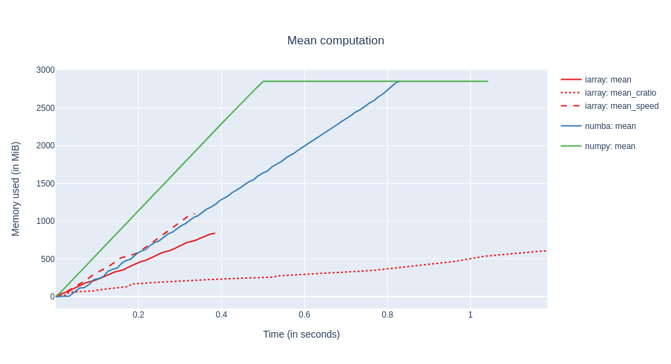

---
jupytext:
  formats: md:myst
  text_representation:
    extension: .md
    format_name: myst
    format_version: 0.13
    jupytext_version: 1.11.3
kernelspec:
  display_name: Python 3
  language: python
  name: python3
---

+++ {"slideshow": {"slide_type": "slide"}}

# Caterva: A Compressed And Multidimensional Container For Medium/Big Data

The Blosc Developer Team. SciPy Conference 2021.

+++ {"slideshow": {"slide_type": "slide"}}

## Who we are?

Caterva is an open source project that has been created by Aleix Alcacer, member of the Blosc Development Team. The leader and founder of this group is Francesc Alted, an open source enthusiast responsible of projects like PyTables or Blosc. Other members are Nathan Moinvaziri, who is making great strides in making C-Blosc and C-Blosc2 more secure, Oscar Guiñon, who collaborated in implementing the multidimensional blocks in Caterva, and Marta Iborra, who is working in Blosc2 Python API.

+++ {"slideshow": {"slide_type": "slide"}}

## Poster Outline

1. **Background**
1. Why Caterva?
    1. Double partitioning. Getting and setting data
    1. No data type info. Buffer and array protocols
    1. Metalayers. ironArray
1. Future Work

+++ {"slideshow": {"slide_type": "slide"}}

## Background

To understand Caterva it is important to know some terms that are directly related to it.

- Data compression is the process of encoding, restructuring or otherwise modifying data in order to reduce its size. Caterva usually works with compressed datasets, making easier to the user to manipulate this processed data.

- Data chunking is a technique that consists of dividing a dataset into partitions of a specific size (chunks). Caterva algorithms implement a deeper level of this strategy to achieve better performance.

+++ {"slideshow": {"slide_type": "slide"}}

## Poster Outline

1. Background
1. **Why Caterva?**
    1. Double partitioning. Getting and setting data
    1. No data type info. Buffer and array protocols
    1. Metalayers. ironArray
1. Future Work

+++ {"slideshow": {"slide_type": "slide"}, "cell_style": "center"}

## Why Caterva?

Caterva is a C library for handling multi-dimensional, chunked, compressed datasets in an easy and fast way. Moreover, there exists not only a Caterva GitHub repository in C, but also a Caterva API in Python.

Todo:

- Insert Caterva image

+++ {"slideshow": {"slide_type": "subslide"}}

### Use cases

Caterva can be used for a great variety of datasets. However, when it really stands out is with multidimensional ones because not every library is prepared to handle these datasets once they are compressed. Specifically, Caterva is really useful for extracting slices of compressed data because, thanks to the chunking machinery it implements, Caterva minimizes the amount of data it has to decompress to obtain the slice, and therefore the time it costs.

Accordingly, for cases where the slicing performance is crucial, Caterva turns out to be a good alternative to Zarr and HDF5.

+++ {"slideshow": {"slide_type": "slide"}}

## Poster Outline

1. Background
1. Why Caterva?
    1. **Double partitioning. Getting and setting data**
    1. No data type info. Buffer and array protocols
    1. Metalayers. ironArray
1. Future Work

+++ {"slideshow": {"slide_type": "slide"}}

## Double partitioning

<!--
    
-->


Tradition chunking libraries store data into multidimensional chunks, which makes slices extraction from compressed data more efficient since only the chunks containing the slices are decompressed instead of the entire superchunk. However, Caterva also introduces a new level of partitioning. Within each chunk, the data is re-chunked into smaller multidimensional sets called blocks.

In this way, Caterva can read blocks individually (and also in parallel) instead of chunks, which improves slices extraction by decompressing only the blocks containing the slice instead of the whole chunks.

+++ {"slideshow": {"slide_type": "slide"}}

### Getting data

In this section, we are going to extract some hyperplanes from chunked arrays created with Caterva, Zarr, and HDF5. We will also analyze the performance differences between these libraries and how double partitioning affects Caterva.

In these three libraries, the data is stored using chunks of Blosc (that internaly are splitted in blocks). However, while Zarr and HDF5 only introduce multidimensionality for chunks, Caterva introduces it for both chunks and blocks.

```{code-cell} ipython3
import zarr
import caterva as cat
import numpy as np
import h5py as h5
import hdf5plugin as h5plugin
%load_ext memprofiler
```

+++ {"slideshow": {"slide_type": "-"}}

First of all, shape, chunks and blocks parameters are defined. As we can see, the second dimension is optimized to extract hyperslices.

```{code-cell} ipython3
shape = (8_000, 8_000)
chunks = (4_000, 100)
blocks = (500, 25)
dtype = np.dtype("f8")
itemsize = dtype.itemsize
```

+++ {"slideshow": {"slide_type": "subslide"}}

Then, a Caterva array, a Zarr array and a HDF5 array are created from a Numpy array using the parameters defined before.

```{code-cell} ipython3
data = np.arange(np.prod(shape), dtype=dtype).reshape(shape)
```

```{code-cell} ipython3
---
slideshow:
  slide_type: '-'
---
c_data = cat.asarray(data, chunks=chunks, blocks=blocks)
```

```{code-cell} ipython3
---
slideshow:
  slide_type: '-'
---
z_data = zarr.array(data, chunks=chunks)
```

```{code-cell} ipython3
f = h5.File('hdf5_file.h5', 'w', driver="core")
f.create_dataset("data", shape, chunks=chunks, data=data, **h5plugin.Blosc())
h_data = f["data"]
```

+++ {"slideshow": {"slide_type": "subslide"}}

Finally, some hyperplanes from the chunked arrays are extracted and the performance is measured using the [*memprofiler*](https://github.com/aleixalcacer/memprofiler) plugin for jupyter.

```{code-cell} ipython3
---
slideshow:
  slide_type: '-'
---
planes_id0 = np.random.randint(0, shape[0], 100)
```

```{code-cell} ipython3
%%mprof_run -q caterva::id0

for i in planes_id0:
    block = c_data[i, :]
```

```{code-cell} ipython3
---
slideshow:
  slide_type: '-'
---
%%mprof_run -q zarr::id0

for i in planes_id0:
    block = z_data[i, :]
```

```{code-cell} ipython3
---
slideshow:
  slide_type: '-'
---
%%mprof_run -q hdf5::id0

for i in planes_id0:
    block = h_data[i, :]
```

```{code-cell} ipython3
---
slideshow:
  slide_type: subslide
---
planes_id1 = np.random.randint(0, shape[1], 100)
```

```{code-cell} ipython3
%%mprof_run -q caterva::id1

for i in planes_id1:
    block = c_data[:, i]
```

```{code-cell} ipython3
---
slideshow:
  slide_type: '-'
---
%%mprof_run -q zarr::id1

for i in planes_id1:
    block = z_data[:, i]
```

```{code-cell} ipython3
---
slideshow:
  slide_type: '-'
---
%%mprof_run -q hdf5::id1

for i in planes_id1:
    block = h_data[:, i]
```

```{code-cell} ipython3
f.close()
```

```{code-cell} ipython3
---
slideshow:
  slide_type: subslide
---
%mprof_barplot --title "Getting data" --variable time --groupby 1 .*
```

+++ {"slideshow": {"slide_type": "subslide"}}

As we can see in the graph, the slicing times are similar in the optimized dimension. However, Caterva performs better (by far) in the non-optimized dimension. This is because with double partitioning you simply have more to decompress the blocks affected by the slice (and not the chunks).

For all this, Caterva can be a good alternative to these widely-used libraries in use cases similar to the one proposed.

+++ {"slideshow": {"slide_type": "slide"}}

### Setting data


Now, we are going to update some hyperplanes from chunked arrays created with Caterva, Zarr, and HDF5. as before, we will also analyze the performance differences between these libraries and how double partitioning affects Caterva.

+++

First, some necessary parameters are defined.

```{code-cell} ipython3
shape = (8_000, 8_000)
chunks = (4_000, 100)
blocks = (500, 25)
dtype = np.dtype("f8")
itemsize = dtype.itemsize
```

Then, an empty array for each library are created with the previous parameters.

```{code-cell} ipython3
---
slideshow:
  slide_type: '-'
---
c_data = cat.empty(shape, itemsize, chunks=chunks, blocks=blocks)

z_data = zarr.empty(shape, dtype=dtype, chunks=chunks)

f = h5.File('hdf5_file.h5', 'w', driver="core")
f.create_dataset("data", shape, chunks=chunks, **h5plugin.Blosc())
h_data = f["data"]
```

+++ {"slideshow": {"slide_type": "subslide"}}

Finally, some hyperplanes from the chunked arrays are updated and the performance is measured as in the previous section.

```{code-cell} ipython3
---
slideshow:
  slide_type: '-'
---
planes_id0 = np.random.randint(0, shape[0], 100)
block_id0 = np.arange(shape[0], dtype=dtype)
```

```{code-cell} ipython3
%%mprof_run -q caterva::id0

for i in planes_id0:
    c_data[i, :] = block_id0
```

```{code-cell} ipython3
---
slideshow:
  slide_type: '-'
---
%%mprof_run -q zarr::id0

for i in planes_id0:
    z_data[i, :] = block_id0
```

```{code-cell} ipython3
---
slideshow:
  slide_type: '-'
---
%%mprof_run -q hdf5::id0

for i in planes_id0:
    h_data[i, :] = block_id0
```

```{code-cell} ipython3
---
slideshow:
  slide_type: subslide
---
planes_id1 = np.random.randint(0, shape[1], 100)
block_id1 = np.arange(shape[1], dtype=dtype)
```

```{code-cell} ipython3
%%mprof_run -q caterva::id1

for i in planes_id1:
    c_data[:, i] = block_id1
```

```{code-cell} ipython3
---
slideshow:
  slide_type: '-'
---
%%mprof_run -q zarr::id1

for i in planes_id1:
    z_data[:, i] = block_id1
```

```{code-cell} ipython3
---
slideshow:
  slide_type: '-'
---
%%mprof_run -q hdf5::id1

for i in planes_id1:
    h_data[:, i] = block_id1
```

```{code-cell} ipython3
---
slideshow:
  slide_type: '-'
---
f.close()
```

```{code-cell} ipython3
---
slideshow:
  slide_type: subslide
---
%mprof_barplot --title "Setting data" --variable time --groupby 1 .*
```

+++ {"slideshow": {"slide_type": "subslide"}}

In this case, the performance is also similar in the optimized dimension. However, there are differences in the non-optimized dimension. Zarr has the worst performance and HDF5 overperforms Caterva.

While Zarr and HDF5 have to *reorganize* the data in chunks, Caterva has to *reorganize* the data in *blocks* (less continuous data in memory).

+++ {"slideshow": {"slide_type": "slide"}}

## Poster Outline

1. Background
1. Why Caterva?
    1. Double partitioning. Getting and setting data
    1. **No data type info. Buffer and array protocols**
    1. Metalayers. ironArray
1. Future Work

+++ {"slideshow": {"slide_type": "slide"}}

## No data type info

Caterva only stores variables itemsize instead of the type. Thanks to that:

- The library is more lightweight.
- It provides a more general utility, allowing users to define their own custom data types via metalayers.

+++ {"slideshow": {"slide_type": "slide"}}

### Buffer and array protocol

Despite not providing a specific type, Caterva supports both the buffer and array protocol. To do this, it defines the elements of the array as byte strings.


```{code-cell} ipython3
---
slideshow:
  slide_type: '-'
---
import caterva as cat
import numpy as np

shape = (1_000, 1_000)
chunks = (500, 20)
blocks = (200, 10)
dtype = np.dtype("f8")
itemsize = dtype.itemsize

a = cat.empty(shape, itemsize, chunks=chunks, blocks=blocks)

for i in range(shape[0]):
    a[i] = np.linspace(0, 1, shape[1], dtype=dtype)
```

+++ {"slideshow": {"slide_type": "subslide"}}

When slices are extracted from Caterva, the result is still another Caterva array. However, this new array is not based on Blosc but on a simple buffer.

```{code-cell} ipython3
---
slideshow:
  slide_type: '-'
---
b = a[5:7, 5:10]

b.info
```

+++ {"slideshow": {"slide_type": "-"}}

In this way, the protocols mentioned above can be used to work with slices of caterva arrays from other libraries.

+++ {"slideshow": {"slide_type": "subslide"}}

But, what happen if we create a numpy array from a caterva array based on a simple buffer?

```{code-cell} ipython3
---
slideshow:
  slide_type: '-'
---
c = np.asarray(b)

c
```

As we can see, if we create a numpy array from a caterva array, de dtype infered is a byte string. However, the original data type is double. Thus, a cast is needed to obtain the desired array.

+++ {"slideshow": {"slide_type": "subslide"}}

To do that in Numpy, the `ndarray.view(dtype)` method can be used. In this case we want to view the numpy array as an array of doubles.

```{code-cell} ipython3
---
slideshow:
  slide_type: '-'
---
c = np.asarray(b).view(dtype)

c
```

Finally, some elements of the caterva array are updated.

```{code-cell} ipython3
b[0] = np.arange(5, dtype=dtype)

c
```

As can be seen, these changes also appear in the numpy array. That is because the data buffer is shared between the Caterva array and the Numpy array. Therefore, having the buffer and array protocols allow Caterva to share data between different libraries with 0 copies. 

+++ {"slideshow": {"slide_type": "slide"}}

## Poster Outline

1. Background
1. Why Caterva?
    1. Double partitioning. Getting and setting data
    1. No data type info. Buffer and array protocols
    1. **Metalayers. ironArray**
1. Future Work

+++ {"slideshow": {"slide_type": "slide"}}

## Metalayers

Metalayers are small metadata for informing about the kind of data that is stored on a Caterva container.
Caterva specifies a metalayer on top of a Blosc2 container for storing multidimensional information. This metalayer can be modified so that the shapes can be updated.

You can use metalayers for adapting Caterva containers to your own needs.

+++ {"slideshow": {"slide_type": "subslide"}}

First, we define the shape and the chunks and blocks for the arrays. Then, we create an array with one metalayer storing a date.

```{code-cell} ipython3
---
slideshow:
  slide_type: '-'
---
import caterva as cat
from struct import pack

urlpath = "arr_with_meta.caterva"

shape = (1_000, 1_000)
chunks = (500, 500)
blocks = (10, 250)

meta = {
    b"date": b"01/01/2021"
}

a = cat.full(shape, fill_value=pack("f", 3.14), chunks=chunks, blocks=blocks, meta=meta,
             urlpath=urlpath)
```

```{code-cell} ipython3
---
slideshow:
  slide_type: subslide
---
a = cat.open(urlpath)
```

In the second place, we get the name of all metalayers on the array:

```{code-cell} ipython3
a.meta.keys()
```

Now we get the informatrion stored in the *date* metalayer:

```{code-cell} ipython3
assert a.meta.get("date") == a.meta["date"]

a.meta["date"]
```

Once we know the information, we update the content of the *date* metalayer. It is important to remember that the length of a Caterva metalayer can not change, so you must be careful when updating. 

Use vl-metalayers (in the roadmap).

```{code-cell} ipython3
a.meta["date"] = b"08/01/2021"
try:
    a.meta["date"] = b"8/1/2021"
except ValueError as err:
    print(err)
```

+++ {"slideshow": {"slide_type": "subslide"}}

Finally, you must know that Caterva introduces by itself a metalayer in the beginning of the array storing the multidimensional information. You can inspect this Caterva metalayer easily:

```{code-cell} ipython3
---
slideshow:
  slide_type: '-'
---
import msgpack

caterva_meta = msgpack.unpackb(a.meta.get("caterva"))

print(f"Format version: {caterva_meta[0]}")
print(f"N. dimensions: {caterva_meta[1]}")
print(f"Shape: {caterva_meta[2]}")
print(f"Chunks: {caterva_meta[3]}")
print(f"Blocks: {caterva_meta[4]}")

cat.remove(urlpath)
```

+++ {"slideshow": {"slide_type": "slide"}}

### Iron Array

ironArray is an example of a library built on top of Caterva. It is a lightweight, flexible and fast toolkit for managing floating-point datasets.

The highlights of ironArray are:

- High performance matrix and vector computations.
- Automatic data compression and decompression.
- Contiguous or sparse storage.
- Tunable performance optimizations that leverage your specific CPUs caches, memory and disks.

For more information about ironArray, see: https://ironarray.io

+++ {"slideshow": {"slide_type": "slide"}}

#### Example

```{code-cell} ipython3
# import iarrayce as ia

# Example of use
```

+++ {"slideshow": {"slide_type": "slide"}}

#### Computation performance

In this plot, we can see the performance of ironArray (*ia*) computing the mean of three datasets against numba (*nb*) and numpy (*np*):


We see that numba takes even more time than NumPy. This is probably because of the additional time required by the compilation step in numba. Memory wise the consumption is very low, but this is expected because we are reusing an existing NumPy array as the destination of the computation; in general, and for large datasets, the memory consumption of numba should be very close to NumPy.

+++ {"slideshow": {"slide_type": "slide"}}

## Poster Outline

1. Background
1. Why Caterva?
    1. Double partitioning. Getting and setting data
    1. No data type info. Buffer and array protocols
    1. Metalayers. ironArray
1. **Future Work**

+++ {"slideshow": {"slide_type": "slide"}}

## Future Work

- Resize array dimensions: this will allow to increase or decrease in size any dimension of the arrays.

- Improve slicing capabilities: currently Caterva only supports basic slicing based on start:stop ranges; we would like to extend this to start:stop:step as well as selections based on an array of booleans (similar to NumPy).

- Provide Python wheels: this will make the installation much more easier for the user.

- Introduce variable-length metalayers: this would provide users a lot of flexibility to define their own metadata.

+++ {"slideshow": {"slide_type": "slide"}}

## Acknowledgments

From the Caterva team we are glad to give a big thank to:

- SciPy for allowing us to participate in the congress.

- The NumFOCUS foundation for sponsoring Blosc.

- Huawei for making a donation that allowed us to get started with Caterva.

- ironArray for making a donation to finish outlining Caterva.
